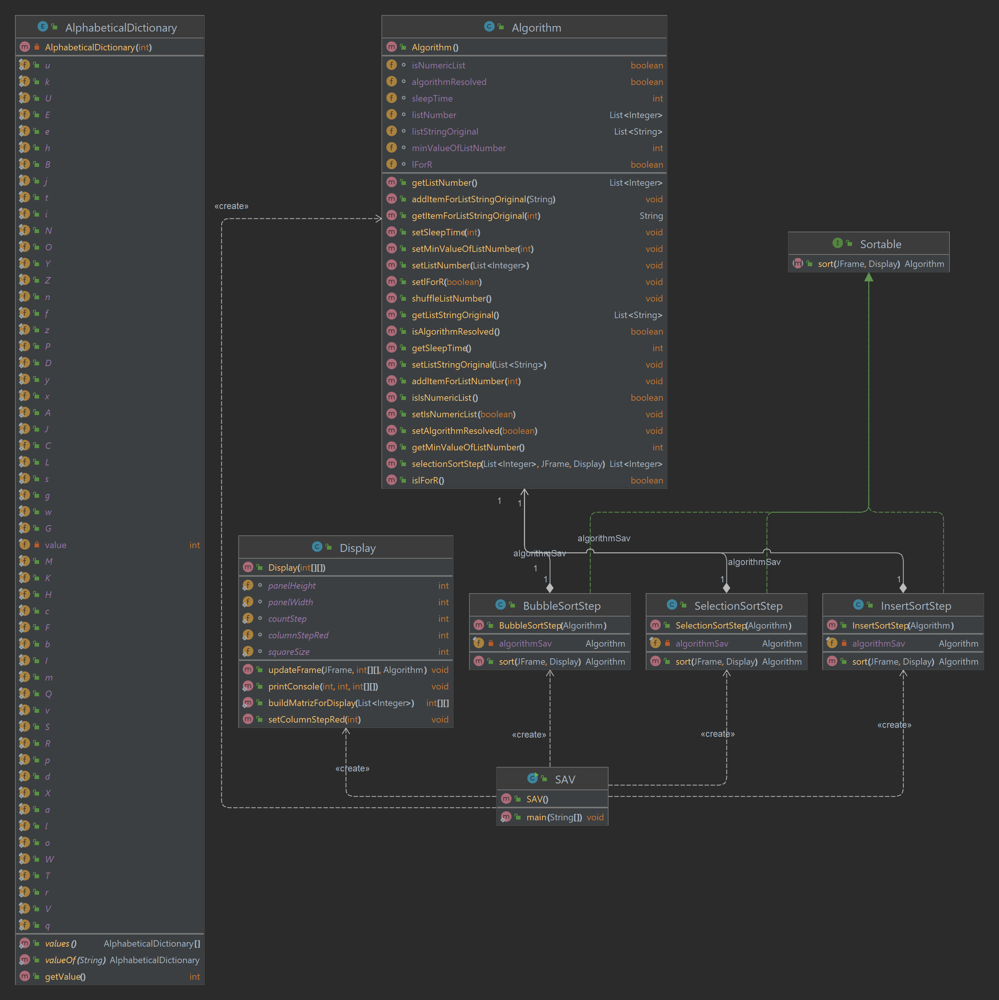
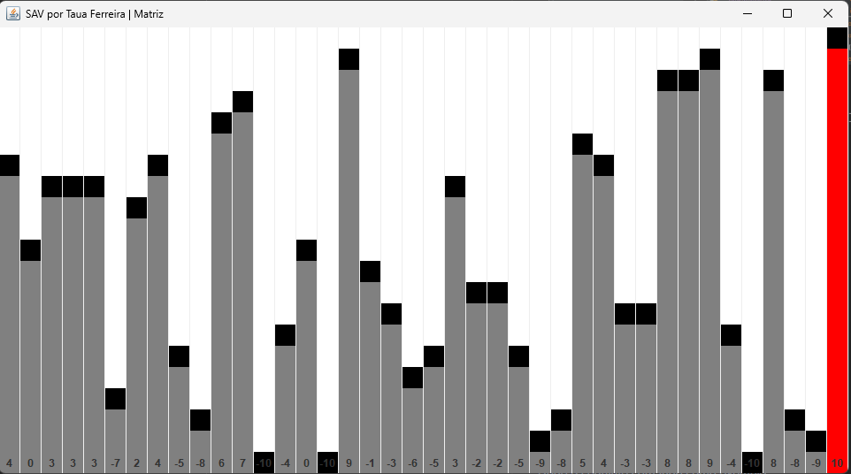
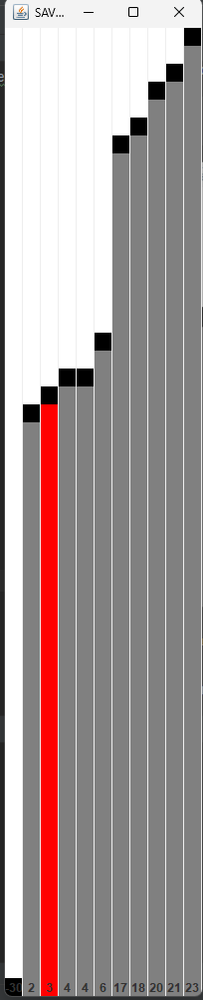
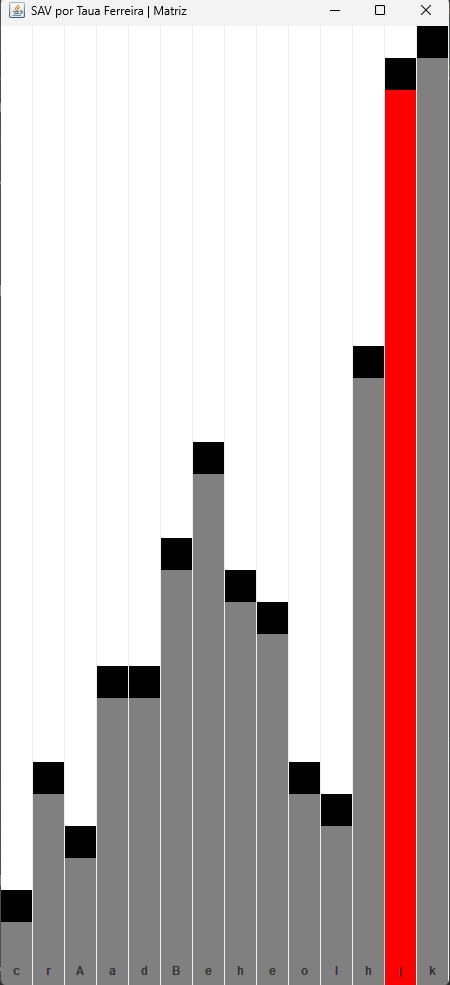

# SAV por Tauã Ferreira

O SAV (Sistema de Ordenação e Visualização) é um projeto Java desenvolvido para facilitar a ordenação de listas de elementos, sejam eles caracteres ou valores numéricos, utilizando diferentes algoritmos de ordenação, como o Bubble Sort, Insertion Sort e Selection Sort. Além da funcionalidade básica de ordenação, o projeto também oferece uma interface gráfica que permite visualizar o processo de ordenação em tempo real.

# Diagrama de Classe

# Como utilizar?

| Parâmetro | Descrição | Valores |
| --- | --- | --- |
| t | tipo da lista | n(lista númerica) ou c (lista de caracteres) 
| s | velocidade em milisegundos | inteiros entre 100 e 1000 |
| in | gerar aleatoriamente ou usar lista da entrada | m(usar lista fornecida) ou r(gerar aleatoriamente) |
| v | lista de itens | aceita inteiros e caracteres separados por vírgula ou espaço |
| o | ordenar | az(ordem crescente) ou za(ordem descrescente) |
| r | quantidade de itens aleatórios | gerar uma quantidade entre 1 e 40 |

## Usando listas númericas

### Aleatórias:

Rode o seguinte comando como exemplo para que o próprio sistema gere a lista:
    
    java SAV t=n in=r r=40 s=150 o=az

Irá ser gerado uma lista aleatória de números
    

### Definidas pelo usuário:

    java SAV t=n in=m v="-30, 21, 4, 2, 17, 6, 3, 4, 20, 18, 23" s=150 o=az

## Usando lista de caracteres

Use o seguinte comando como exemplo mudando o tipo de lista:

    java SAV t=c in=m v="c, r, A, a, d, B, e, h, e, o, l, h, j, k" s=150 o=az

## Mudar algoritmo:

### Tipos:

#### Bubble sort: para usar use a=b
Exemplo: 

    java SAV t=c in=m v="c, r, A, a, d, B, e, h, e, o, l, h, j, k" s=150 o=az a=b

#### Insert sort: para usar use a=i
Exemplo: 

    java SAV t=c in=m v="c, r, A, a, d, B, e, h, e, o, l, h, j, k" s=150 o=az a=i
#### Selection sort: para usar use a=s

Exemplo: 

    java SAV t=c in=m v="c, r, A, a, d, B, e, h, e, o, l, h, j, k" s=150 o=az a=s

## Mude a ordem

Use o arguemnto o=az ou o=za para mudar o sentido de ordenação

## Validação da entrada:

O sistema já válida se algum argumento é inválido, leia os erros para executar corretamente

## Terminal

Também é mostrado no terminal por meio de asteriscos as colunas que estão sendo geradas e o passo-a-passo dos algoritmos